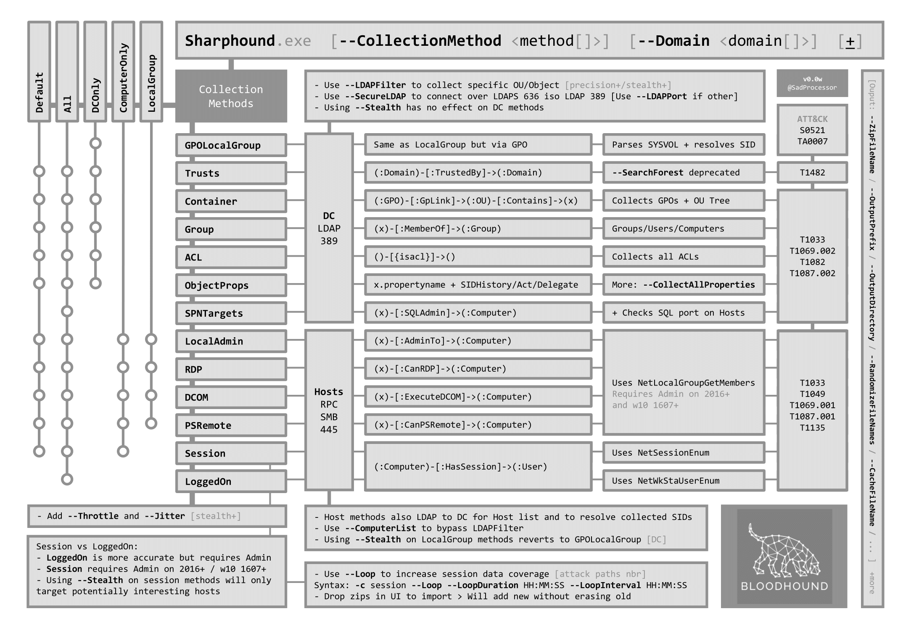

# BloodHound ⚙️

## Theory

[BloodHound](https://github.com/BloodHoundAD/BloodHound) (Javascript webapp, compiled with Electron, uses [Neo4j](https://neo4j.com/) as graph DBMS) is an awesome tool that allows mapping of relationships within Active Directory environments. It mostly uses Windows API functions and LDAP namespace functions to collect data from domain controllers and domain-joined Windows systems.

## Practice

### Collection

BloodHound needs to be fed JSON files containing info on the objects and relationships within the AD domain. This information are obtained with collectors (also called ingestors). The best way of doing this is using the official SharpHound (C#) collector.

::: tabs

=== Windows

SharpHound ([sources](https://github.com/BloodHoundAD/SharpHound), [builds](https://github.com/BloodHoundAD/BloodHound/tree/master/Collectors)) is designed targeting .Net 4.5. It can be used as a compiled executable.

It must be run from the context of a domain user, either directly through a logon or through another method such as runas (`runas /netonly /user:$DOMAIN\$USER`) (see [Impersonation](../../movement/credentials/impersonation.md)). Alternatively, SharpHound can be used with the `LdapUsername` and `LdapPassword` flags for that matter.

```bash
SharpHound.exe --collectionmethods All
```

> [!TIP]
> When running SharpHound from a `runas /netonly`-spawned command shell, you may need to let SharpHound know what username you are authenticating to other systems as with the `OverrideUserName` flag

The previous commands are basic but some options (i.e. Stealth and Loop) can be very useful depending on the context

```bash
# Perform stealth collection methods
SharpHound.exe --collectionmethods All --Stealth

# Loop collections (especially useful for session collection)
# e.g. collect sessions every 10 minutes for 3 hours
SharpHound.exe --collectionmethods Session --Loop --loopduration 03:00:00 --loopinterval 00:10:00

# Use LDAPS instead of plaintext LDAP
SharpHound.exe --secureldap
```

More help on the CLI commands [here](https://github.com/BloodHoundAD/SharpHound#cli).

> [!SUCCESS]
> Here are a few tips and tricks on the collection process
> 
> * Testers can absolutely run SharpHound from a computer that is not enrolled in the AD domain, by running it in a domain user context (e.g. with runas, [pass-the-hash](../../movement/ntlm/pth.md) or [overpass-the-hash](../../movement/kerberos/ptk.md)). This is useful when domain computers have antivirus or other protections preventing (or slowing) testers from using enumerate or exploitation tools.
> * When obtaining a foothold on an AD domain, testers should first run SharpHound with all collection methods, and then start a loop collection to enumerate more sessions.


=== UNIX-like

From UNIX-like system, a non-official (but very effective nonetheless) Python version can be used.

[BloodHound.py](https://github.com/fox-it/BloodHound.py) is a Python ingestor for BloodHound.

```bash
bloodhound.py --zip -c All -d $DOMAIN -u $USERNAME -p $PASSWORD -dc $DOMAIN_CONTROLLER
```

> [!TIP]
> This ingestor is not as powerful as the C# one. It mostly misses GPO collection methods but a good news is that it can do pass-the-hash. It becomes really useful when compromising a domain account's NT hash.

An alternative called [RustHound](https://github.com/OPENCYBER-FR/RustHound) (Rust) can be used as well.

```bash
rusthound --zip -d "$DOMAIN" -i "$DC_IP" -u '$USER@$DOMAIN' -p '$PASSWORD' -o "OUTDIR"
```

:::


### Analysis

Once the collection is over, the data can be uploaded and analyzed in BloodHound by doing the following.

* Find paths between specified nodes
* Run pre-built analytics queries to find common attack paths
* Run custom queries to help in finding more complex attack paths or interesting objects
* Run manual neo4j queries
* Mark nodes as high value targets for easier path finding
* Mark nodes as owned for easier path finding
* Find information about selected nodes: sessions, properties, group membership/members, local admin rights, Kerberos delegations, RDP rights, outbound/inbound control rights (ACEs), and so on
* Find help about edges/attacks (abuse, OPSEC considerations, references)

Using BloodHound can help find attack paths and abuses like [ACEs abuse](../../movement/dacl/index), [Kerberos delegations abuse](../../movement/kerberos/delegations/index), [credential dumping](../../movement/credentials/dumping/index) and [credential shuffling](../../movement/credentials/shuffling.md), [GPOs abuse](../../movement/group-policies.md), [Kerberoast](../../movement/kerberos/kerberoast.md), [ASREProast](../../movement/kerberos/asreproast.md), [domain trusts attacks](../../movement/trusts/index), etc.


For detailed and official documentation on the analysis process, testers can check the following resources: [the BloodHound GUI](https://bloodhound.readthedocs.io/en/latest/data-analysis/bloodhound-gui.html), [nodes](https://bloodhound.readthedocs.io/en/latest/data-analysis/nodes.html) and [edges](https://bloodhound.readthedocs.io/en/latest/data-analysis/edges.html).

> [!SUCCESS]
> Some custom queries can be used to go even further with the analysis of attack paths, such as [Exegol's custom queries](https://github.com/ThePorgs/Exegol-images/blob/3d6d7a41e46acb6898da996c4198971be02e4d77/sources/bloodhound/customqueries.json).

> [!SUCCESS]
> Here are some examples of quick wins to spot with BloodHound
> 
> * shadow admins: users that are not members of privileged Active Directory groups but have sensitive privileges over the domain (run graph queries like "find principals with [DCSync](../../movement/credentials/dumping/dcsync.md) rights", "users with most local admin rights", or check "inbound control rights" in the domain and privileged groups node info panel)
> * other over-privileged users: user that can control many objects ([ACEs](../../movement/dacl/index)) and that often leads to admins, shadow admins or sensitive servers (check for "outbound control rights" in the node info panel)
> * over-privileged computers: find computers that can do [(un)constrained Kerberos delegation](../../movement/kerberos/delegations/index) (run graph queries like "find computer with unconstrained delegations")
> * admin computers: find computers (A) that have admin rights against other computers (B). This can be exploited as follows: computer A triggered with an [MS-RPRN abuse (printerbug),](../../movement/mitm-and-coerced-authentications/ms-rprn.md) authentication is then [relayed](../../movement/ntlm/relay.md), and credentials are [dumped](../../movement/credentials/dumping/index) on the computer B.
> 
> Other quick wins can be easily found with the [bloodhound-quickwin](https://github.com/kaluche/bloodhound-quickwin) Python script
> 
> ```bash
> bhqc.py -u $neo4juser -p $neo4jpassword
> ```

> [!SUCCESS]
> [CrackHound](https://github.com/trustedsec/CrackHound) (Python) can be used to populate BloodHound's database with password obtained during a pentest. This can help sort and report attack paths.

## Resources



https://github.com/SadProcessor/HandsOnBloodHound/blob/master/BH21/BH4_SharpHound_Cheat.pdf

[https://blog.riccardoancarani.it/bloodhound-tips-and-tricks/](https://blog.riccardoancarani.it/bloodhound-tips-and-tricks/)

[https://bloodhound.readthedocs.io/en/latest/](https://bloodhound.readthedocs.io/en/latest/)

[https://porterhau5.com/blog/extending-bloodhound-track-and-visualize-your-compromise/](https://porterhau5.com/blog/extending-bloodhound-track-and-visualize-your-compromise/)
