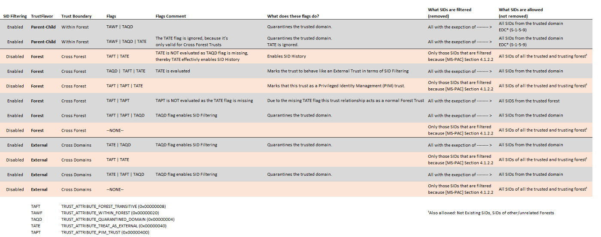

# 🛠️ OAuth 2.0

## Theory

OAuth 2.0 is a widely used framework across websites on the internet. It provides authorization.  
**Example**: it allows a third-party application to access a user's resource \(name, age, location, etc.\). 

Over time, OAuth 2.0 also started to provide authentication \(check [OpenID Connect](https://openid.net/connect/)\).  
**Example**: it allows a user to connect to a third-party website using its social media accounts.

Before understanding the attack vectors, one must understand the basics of OAuth 2.0's mechanism. In order to keep this note short and handy for pentesters, the details will be left out \(links to relevant articles will be provided\).

### Misconfigurations

The exploitation will depend on the misconfiguration. The next image shows a road that can be followed:  
🛠️ **Image here.**

The misconfiguration types can be better understood with this table:

🛠️ **To continue.**

## Practice


For each misconfiguration described below, check the countermeasures presented in the [OAuth 2.0 Security Best Current Practice](https://tools.ietf.org/id/draft-ietf-oauth-security-topics-15.html#name-attacks-and-mitigations). Even if some misconfigurations are present, the information retrieved from them may not be usable due to countermeasures applied.


### Insufficient Redirect URI Validation

In some cases, clients are allowed to use pattern matching in the definition of their redirect URI. The authorization server then verifies that URI. When the URI pattern is not defined properly, and the validation is insufficient, it can lead to an attacker stealing the authorization code or access token.

#### Authorization Code Grant

Upon getting a `client_id`, it's possible to test this misconfiguration by providing the authorization server with a fake URI. Depending on the server's HTTP response, misconfiguration is present.

In the case where the client is confidential \(requiring authentication with the client's secret\), one can bypass it by using the Authorization Code Injection attack.

**Implicit Grant**

To test the redirect URI validation misconfiguration with the implicit grant, the client application needs to hold an [open redirect](https://app.gitbook.com/@shutdown/s/the-hacker-recipes/~/drafts/-MhmLsf3_kmf_BhO6cGF/web-services/attacks-on-inputs/open-redirect) vulnerability. The implicit grant is handy for targeting wildcards on query parameters.

Upon getting a `client_id`, it's possible to test this misconfiguration by abusing the open redirect vulnerability and providing the authorization server with a fake URI. Depending on the server's HTTP response, misconfiguration is present.

### Credential Leakage via Referer Headers

The `referer` header could leak important information such as the authorization code, the state, or the access token.

#### **Leakage from the OAuth Client**

When a client gets to a page as a result of a successful authorization request, the tester has to check whether the page:

* contains links to other pages under an attacker's control,
* a third-party content \(iframes, images...\) that can be loaded.

#### **Leakage from the Authorization Server**

In a similar way, the tester has to check the same points as the OAuth client, but in the authorization server endpoint.

### Credential Leakage via Browser History

If an attacker has an access to a victim's browser, it can search for authorization codes and access tokens present in the history of visited URLs.

### Authorization Code Injection

The goal here is to impersonate a victim by injecting a stolen authorization code into the attacker's own session with the client. Confidential clients are targeted by this attack.   
This attack is not possible if:

* The client sends a `code_challenge` in the Authorization request, which means it's using [PKCE](https://oauth.net/2/pkce/) to prevent some of the OAuth attacks.
* The client in an OpenID Connect layer uses a `nonce` to prevents replay attacks.

### Cross-Site Request Forgery CSRF

If the `state` parameter is not used in the authentication request, a CSRF attack is possible.

## References









